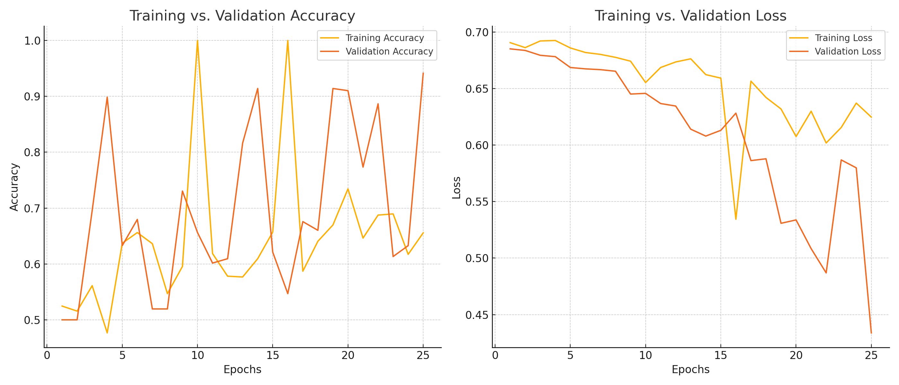

# 🧠 AI Model Comparison: Overfitting Reduction through Architectural Changes

This project builds and compares two Convolutional Neural Networks (CNNs) to classify images of horses vs. humans using TensorFlow and Keras. The dataset was provided as part of coursework in machine learning, and I iterated on a baseline model to improve performance and reduce overfitting.

---

## 📁 Dataset

- Training and validation sets were sourced from Google-hosted zipped datasets:
  - [`horse-or-human.zip`](https://storage.googleapis.com/learning-datasets/horse-or-human.zip)
  - [`validation-horse-or-human.zip`](https://storage.googleapis.com/learning-datasets/validation-horse-or-human.zip)

---

## 🧠 Baseline Model

- **Architecture:**
  - 4 Convolutional + MaxPooling layers
  - 2 Dense layers (512, 256 units)
- **Training:**
  - 100 epochs
  - No regularization
- **Results:**
  - Validation accuracy peaked at ~91%
  - Significant signs of overfitting (training accuracy reached 100%, val loss increased)

---

## 🔄 Key Changes Made

To address overfitting and improve generalization, the following changes were applied to the original model:

- 🔽 **Reduced Layer Density**: Neuron counts in fully connected layers were halved.
- 🧹 **Early Stopping**: Implemented `EarlyStopping` with Patience = 5 on val_loss to prevent overtraining.
- ⏱ **Fewer Epochs**: Reduced training epochs from 100 to 25.
- 🎯 **Dropout Regularization**: Added `Dropout(0.1)` after the densest layer.

---

## 📈 Performance Comparison

| Metric            | Original Model | Optimized Model |
|------------------|----------------|---------------|
| Final Val Accuracy | ~91%         | **~94%**      |
| Overfitting Signs | Significant   | Greatly Reduced |
| Epochs            | 100           | 25            |
| Dropout           | ❌            | ✅ 10%         |

---

### 📉 Training Curves



---

### 🧱 Revised Model Architecture (Simplified)

```
┏━━━━━━━━━━━━━━━━━━━━━━━━━━━━━━━━━┳━━━━━━━━━━━━━━━━━━━━━━━━┳━━━━━━━━━━━━━━━┓
┃ Layer (type)                    ┃ Output Shape           ┃       Param # ┃
┡━━━━━━━━━━━━━━━━━━━━━━━━━━━━━━━━━╇━━━━━━━━━━━━━━━━━━━━━━━━╇━━━━━━━━━━━━━━━┩
│ conv2d_20 (Conv2D)              │ (None, 98, 98, 16)     │           448 │
│ max_pooling2d_20 (MaxPooling2D) │ (None, 49, 49, 16)     │             0 │
│ conv2d_21 (Conv2D)              │ (None, 47, 47, 32)     │         4,640 │
│ max_pooling2d_21 (MaxPooling2D) │ (None, 23, 23, 32)     │             0 │
│ conv2d_22 (Conv2D)              │ (None, 21, 21, 64)     │        18,496 │
│ max_pooling2d_22 (MaxPooling2D) │ (None, 10, 10, 64)     │             0 │
│ conv2d_23 (Conv2D)              │ (None, 8, 8, 128)      │        73,856 │
│ max_pooling2d_23 (MaxPooling2D) │ (None, 4, 4, 128)      │             0 │
│ flatten_5 (Flatten)             │ (None, 2048)           │             0 │
│ dense_17 (Dense)                │ (None, 256)            │       524,544 │
│ dropout_7 (Dropout)             │ (None, 256)            │             0 │
│ dense_18 (Dense)                │ (None, 128)            │        32,896 │
│ dense_19 (Dense)                │ (None, 1)              │           129 │
└─────────────────────────────────┴────────────────────────┴───────────────┘
```

---

## ✅ Future Work

- Experiment with additional dropout layers or regularizers
- Introduce learning rate scheduling
- Try data augmentation tuning
- Visualize more filters and activations

---

## 📌 How to Use

1. Clone the repo
2. Run the notebook or script in Google Colab or local TensorFlow environment
3. Upload an image to classify it as a horse or human

---

📌 *Conv. Neural Network ML Model Optimizations and Comparison summary by Nathan Rozok — AI Product Manager focused on building ethical, scalable AI solutions.*
